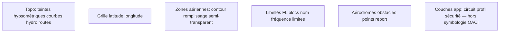

# Référence visuelle — styles des zones sur carte VFR papier

Document de travail pour **Glide Task Planner** (vav-angular) : synthèse des conventions observées sur deux cartes aéronautiques VFR papier (photos, mai 2026), afin d’orienter l’évolution du rendu des espaces aériens POAFF dans l’application.

**Sources visuelles :** photos utilisateur — secteurs Digne-les-Bains / Castellane / Mercantour et Grenoble / Chambéry / Albertville (cartes pliées, échelles typiques 1:250 000 ou 1:500 000).

**Important :** ce document décrit une **référence visuelle et sémantique**. Il ne constitue pas une reproduction officielle d’une carte OACI/DGAC ni une autorisation de navigation. Les données exploitées par l’app restent **POAFF** (vol libre, non certifiées pour la navigation).

**Dernière mise à jour :** mai 2026.

---

## 1. Contexte et périmètre

| Couche de réalité | Rôle |
|-------------------|------|
| **Carte VFR papier** (SIA, éditeurs type Cartabossy, etc.) | Navigation VFR de référence humaine ; symbologie normalisée par l’usage et l’édition. |
| **POAFF** (GeoJSON FFVL) | Zones dédiées pratique du vol libre ; propriétés `class`, `type`, `stroke`, `fill`, `activationCode`, `Mhz`, etc. |
| **Rendu app** | MapLibre : `fill` + `line` + halo, couleurs lues depuis les propriétés POAFF ([`airspace-map-layers.util.ts`](../src/app/utils/airspace-map-layers.util.ts)). |

**Rappels techniques déjà traités côté impression :** projection **Web Mercator** (MapLibre) ≠ projection cartographique Lambert des cartes papier ; échelle nominale 1:250 000 au centre de feuille, pas une certification OACI.

---

## 2. Hiérarchie des couches (ordre de lecture)

Sur la carte papier, l’information se lit du fond vers le premier plan :

**Principe de lisibilité :** le fond topographique reste **muted** (verts/bruns désaturés) pour que les traits **bleu** et **rouge** aéronautiques dominent visuellement.

---

## 3. Styles par famille de zones

### 3.1 Tableau synthétique (observations photos)

| Famille | Exemples sur carte | Couleur contour | Remplissage | Trait | Effet bord |
|---------|-------------------|-----------------|-------------|-------|------------|
| **Espace contrôlé** | TMA, CTA, CTR | Bleu foncé, trait épais | Bleu clair semi-transparent | Continu | **Peigne** ou halo bleu **vers l’intérieur** de la zone |
| **Restreint / interdit / danger** | R, P, D | Rouge vif | Rouge pâle ou **hachures diagonales** rouges | Continu ou **tirets** si intermittent | Peigne rouge possible |
| **Parcs / protection nature** | Mercantour, réserves | Vert ou brun-orange | Très léger, souvent transparent | Continu ou tirets fins | — |
| **Secteurs activité / planeur** | Secteurs locaux, protocoles | Bleu ou orange fin | Faible opacité | Tirets | — |
| **Zones protégées oiseaux / ZSM** (souvent sur POAFF plus que sur extrait photo) | ZSM, GP | Orange ou bleu selon édition | Clair, peu intrusif | Continu ou tirets | — |

### 3.2 Espace contrôlé (classe D, C — TMA, CTA, CTR)

**Contour**

- Trait **bleu foncé**, épaisseur nettement supérieure aux routes ou parcs.
- Effet **« peigne »** : petits traits perpendiculaires ou bande/lueur bleue claire **côté intérieur** de la zone — indique clairement de quel côté de la ligne se trouve l’espace contrôlé (équivalent mental du « tick marks » ICAO sur certaines cartes).

**Remplissage**

- Teinte **bleu clair**, opacité modérée : le relief et le réseau routier restent visibles en transparence.

**Libellés de limites verticales**

- **Grand texte bleu** le long du bord ou dans la zone : `FL 195`, `FL 115`, `FL 95`, `FL 75`, etc.
- Police sans-serif, **grasse**, taille supérieure aux toponymes.

**Blocs d’information** (rectangles ou texte libre)

Structure typique en 2 à 4 lignes :

1. **Nom / identifiant** — ex. `CTA 2 Marseille`, `CTR CANNES 1`.
2. **Fréquence** — ex. `120.550`, `118.150` (souvent 3 décimales).
3. **Limites verticales** — format **plafond / plancher** :
   - `FL 145 / FL 135`
   - `FL 75 / 3000 ASFC` (plancher au-dessus du sol / altimètre)
   - `SFC / FL 065` (surface → plafond)

**Couleur du texte :** alignée sur la zone (bleu sur fond bleu clair, lisibilité par contraste avec halo blanc implicite du papier).

### 3.3 Zones R, P, D (restreint, prohibé, danger)

**Contour**

- **Rouge vif**, trait plein pour zones permanentes.
- **Tirets rouges** pour zones à activation **intermittente** (voir §4).

**Remplissage**

- Rose/rouge très clair, ou **hachures diagonales** rouges (zones D ou P particulièrement sensibles).

**Libellés**

- Identifiant zone en rouge : `R 196 A2`, etc.
- Limites verticales en rouge, même logique plafond/plancher que les zones bleues.
- Fréquences et administrateur dans un bloc compact (équivalent champs `desc` / `Mhz` POAFF).

### 3.4 Parcs, environnement, limites spéciales

**Observé (photo Mercantour / Alpes)**

- Contour **vert** (parc national) ou **brun-orange** (autres protections).
- Peu ou pas de remplissage opaque : priorité au contexte terrain.
- Texte explicatif discret (nom du parc, règles locales).

**Usage pour l’app :** ces zones POAFF (`GP|PROTECT`, `ZSM|PROTECT`) doivent rester **visibles mais secondaires** par rapport aux TMA/R pour le briefing sécurité.

### 3.5 Secteurs planeur et protocoles locaux

- Lignes **bleu clair** ou **orange** en **tirets**.
- Moins d’emprise visuelle que TMA/CTR.
- Peuvent chevaucher des CTR avec mention d’exception dans le texte (POAFF : `FFVL|FFVL-Prot`, etc.).

---

## 4. Légende des traits (bord de carte)

La légende imprimée sur la carte (coin inférieur, photo 1) distingue le **statut temporel** du contour :

| Symbole légende | Signification carte | Équivalent POAFF typique |
|-----------------|---------------------|-------------------------|
| **Trait plein** | Zone **en permanence** | `activationCode: H24` |
| **Trait tireté** | Zone **par intermittence** | `HX`, `TIMSH` + `activationDesc` |
| **Trait pointillé** | Statut **non continu** / limite particulière | Cas limites, parcs, certaines transitions |

**Champs POAFF utiles :** `activationCode`, `activationDesc`, `timeScheduling` ([`PoaffProperties`](../src/app/services/airspace-layer.service.ts)).

**Recommandation rendu app :** mapper ces codes vers `line-dasharray` MapLibre (plein vs `[4,2]` vs `[1,2]`), pas seulement une opacité différente.

---

## 5. Fond topographique

### 5.1 Éléments observés (les deux photos)

| Élément | Style papier |
|---------|----------------|
| **Teintes hypsométriques** | Vallées vert tendre → collines brun clair → sommets brun foncé |
| **Courbes de niveau** | Fines, brun clair, espacement selon pente |
| **Hydrographie** | Bleu moyen (rivières, lacs) |
| **Agglomérations** | Polygones jaune ou orange clair |
| **Routes** | Rouge ou orange fin (axes principaux plus visibles) |
| **Points cotés** | Point noir + altitude (ex. `2115`) sur sommets |
| **Ombrage relief** | Hillshade (ombres nord-ouest) : relief « 3D » sur papier |

### 5.2 Rapport avec l’application

- **Carte interactive / briefing :** fond **planimétrique** préférable (`carto-light`, `esri-topo`, `opentopo`) — **sans** terrain MapLibre 3D ni hillshade DEM ([`buildPrintBaseMapStyle`](../src/app/components/map-view/map-style.constants.ts) pour l’impression).
- **Satellite :** ombrage naturel des photos = faux relief, peu adapté à une lecture type carte OACI.
- **Mapterhorn DEM gris :** utile au profil terrain, pas comme fond « carte VFR ».

---

## 6. Symboles et points aéronautiques

### 6.1 Aérodromes

- Symbole : **cercle** (souvent bleu avec bord jaune pour civil).
- **Orientation des pistes** : petit rectangle ou trait dans le cercle.
- **Encadré blanc** à proximité :
  - Nom (ex. `VINON`, `GRENOBLE`)
  - Élévation en mètres (`275 m`)
  - Fréquence principale (`118.150`)

### 6.2 Obstacles

- Symbole type **tour** ou « A » stylisé.
- Hauteur indiquée : `h 1006` (pieds ou mètres selon édition — vérifier légende carte).

### 6.3 Points de report / balises

- Triangles, cercles pleins, parfois identifiant alphanumérique.
- Moins prioritaire que TMA/R pour le style zones POAFF.

### 6.4 Grille

- Grille **bleu-gris clair** (méridiens / parallèles).
- Labels `45°30'`, `6°` le long des axes.

---

## 7. Typographie et contraste

| Usage | Style observé |
|-------|----------------|
| **Niveaux de vol (FL)** | Sans-serif, **gras**, grande taille, couleur = famille de zone |
| **Villes** | MAJUSCULES, noir, taille moyenne |
| **Villages** | Mixed case, plus petit |
| **Blocs zone (nom + freq + limites)** | 8–10 pt équivalent, 2–3 lignes, fond blanc implicite |
| **Fréquences** | 3 décimales, parfois suffixe rôle (`Twr`, `App`, `Info`) dans le nom POAFF `nameV` |

**Règle d’or :** ne pas superposer des libellés FL trop petits sur le fond satellite ; préférer halo/contour ou regroupement en popup / liste / coupe profil (déjà partiellement en place dans l’app).

---

## 8. Rapprochement POAFF → carte VFR → application

### 8.1 Propriétés POAFF exploitables

| Propriété | Usage carte VFR | Usage app actuel |
|-----------|-----------------|------------------|
| `class` | Famille ICAO (D, C, R, P, GP, ZSM…) | Filtres + couleur source |
| `type` | Sous-type (TMA, CTR, CTA, R, PROTECT…) | Filtres + affichage |
| `stroke`, `fill` | Couleur officielle fichier POAFF | `line-color`, `fill-color` MapLibre |
| `stroke-width`, `*-opacity` | Épaisseur / transparence | Partiellement (fill × 0.55) |
| `lower`, `upper`, `lowerM`, `upperM` | Libellés bord | Popup, liste branche, coupe, PDF récap |
| `Mhz` | Fréquences structurées | Récap impression, à exposer sur carte |
| `activationCode`, `activationDesc` | Plein / tirets | **Non** — trait toujours continu |
| `nameV` | Souvent `NOM Rôle(freq)` | Nom affiché |

### 8.2 Palette POAFF observée (échantillon `FrenchAlps`, avril 2025)

Comptage indicatif sur le fichier régional — les couleurs sont **déjà dans le GeoJSON** :

| class \| type | Nb zones (ordre) | stroke | fill |
|-------------|------------------|--------|------|
| GP \| PROTECT | 139 | `#f07800` | `#f07800` |
| R \| R | 104 | `#800080` | `#ffb9dc` |
| D \| TMA | 31 | `#ff0000` | `#ff8080` |
| ZSM \| PROTECT | 30 | `#0000ff` | `#ceeffe` |
| P \| P | 28 | `#ff0000` | `#ff8080` |
| C \| TMA | 26 | `#ff0000` | `#ff8080` |
| D \| CTR | 22 | `#ff0000` | `#ffb9dc` |
| D \| CTA | 19 | `#ff0000` | `#ff8080` |
| FFVL \| FFVL-Prot | 10 | `#008040` | `#80ff80` |

### 8.3 Rendu MapLibre actuel

Fichier : [`src/app/utils/airspace-map-layers.util.ts`](../src/app/utils/airspace-map-layers.util.ts)

- **Mode 2D :** couche `fill` (`fill-color` ← `fill`, opacité réduite) + contours `line` + **halo** (`AIRSPACE_LINE_HALO` plus large, même couleur `stroke`).
- **Pas de** peigne directionnel, pas de `line-dasharray` selon activation.
- **Mode 3D :** fil de fer / extrusion (profil sécurité) — hors style carte VFR papier.
- **Fallback** si propriétés absentes : [`poaffPaint`](../src/app/services/airspace-layer.service.ts) → magenta `#c026d3` / `#f0abfc`.

### 8.4 Tableau des écarts prioritaires

| Aspect | Carte VFR papier (photos) | POAFF brut | App aujourd’hui |
|--------|---------------------------|------------|-----------------|
| Classe **D / C** (TMA, CTR, CTA) | **Bleu** | Souvent **rouge** `#ff0000` | Rouge (copie POAFF) |
| Classe **R** | **Rouge** | **Violet** `#800080` | Violet |
| Activation intermittente | **Tirets** | Codes `HX` / `TIMSH` | Trait **continu** |
| Côté de la zone | Peigne / halo **intérieur** | — | Halo ligne **symétrique** |
| Libellé **FL** sur le bord | Oui, grand | Dans `upper` / `lower` texte | Popup, liste, coupe — **pas sur la carte** |
| Bloc **nom + freq + limites** | Rectangle structuré | `nameV`, `Mhz`, `desc` | Popup HTML partiel |
| Fond | Topo teinté, pas satellite | — | Basemap utilisateur (défaut print : `carto-light`) |
| Hachures zone D/P | Parfois | Rare dans POAFF | Non |

---

## 9. Pistes d’implémentation (ordre suggéré)

### Phase 1 — Palette et traits (impact fort, effort modéré)

1. **Profil « style carte VFR »** (toggle ou préférence écran) : table `class` → `{ stroke, fill, strokeWidth }` inspirée du §3, **indépendante** des couleurs POAFF quand le profil est actif.
2. **`line-dasharray`** selon `activationCode` :
   - `H24` → plein ;
   - `HX`, `TIMSH` → tirets ;
   - défaut → pointillés légers.
3. Conserver un profil **« POAFF natif »** pour comparer avec les fichiers sources FFVL.

### Phase 2 — Bords et profondeur visuelle

4. **Double ligne** : contour fin + bande intérieure semi-transparente (approximation du peigne sans géométrie complexe).
5. Ajuster `fill-opacity` par famille (CTR plus visible que ZSM).
6. **Épaisseur** variable : CTR/TMA > PROTECT > FFVL-Prot.

### Phase 3 — Libellés carte

7. Couche **symbol** ou **symbol-placement: line** pour `FL xxx` sur les segments de bord (filtrage zoom, anti-chevauchement).
8. **Callout** minimal au clic : nom, `Mhz`, plafond/plancher formatés ([`formatAirspaceVerticalRange`](../src/app/utils/airspace-altitude.util.ts)).

### Phase 4 — Fond et impression

9. Basemap par défaut **topo clair** en profil sécurité + impression (déjà amorcé).
10. Ne jamais activer `terrain` / hillshade pour l’export PDF carte.

### Fichiers code probables pour une future PR

| Fichier | Changement |
|---------|------------|
| `src/app/utils/airspace-vfr-style.util.ts` (nouveau) | Palette VFR, dash, opacités par `class`/`type` |
| `src/app/utils/airspace-map-layers.util.ts` | Brancher expressions paint sur le util ci-dessus |
| `src/app/services/airspace-screen-prefs.service.ts` | Préférence `displayStyle: poaff \| vfr` |
| `src/app/i18n/translations/*.ts` | Libellés du toggle |

---

## 10. Références et liens projet

- Photos de référence : fournies par l’utilisateur (mai 2026), cartes VFR papier France (Alpes du Sud et Nord).
- Données zones app : [POAFF / FFVL](https://parapente.ffvl.fr/) — fichiers sous `public/assets/airspace/`.
- Réglementation circuits / zones obs : [`reglements-circuits-zones-observation.md`](./reglements-circuits-zones-observation.md).
- Audit sources et écarts : [`sources-fiables-audit-implementation.md`](./sources-fiables-audit-implementation.md).

**Note légale :** ne pas reproduire intégralement une carte SIA/Cartabossy propriétaire dans l’app ; s’inspirer des **conventions graphiques** (couleurs, traits, hiérarchie) en s’appuyant sur les données POAFF déjà sous licence d’usage dédiée vol libre.

---

## Annexe A — Checklist revue style (avant merge UI)

- [x] Classe D/C lisible en bleu (symbologie VFR dans `airspace-vfr-style.util.ts`)
- [x] Zones R en rouge, pas violet POAFF brut
- [x] Zones HX / TIMSH en tirets (`line-dasharray` sur `activationCode`)
- [x] Halo coloré selon famille (plus blanc fixe)
- [x] Fil de fer 3D aligné sur palette VFR
- [ ] Fond topo : pas de relief 3D en impression (déjà traité côté print)
- [ ] Barre d’échelle PDF cohérente avec emprise slot carte
- [x] Popup : nom, type, limites, activation
- [ ] Libellés FL le long des bords (phase ultérieure)

## Annexe B — Correspondance rapide `class` POAFF

| class | Signification usuelle | Couleur carte VFR cible | Couleur POAFF Alpes (indicatif) |
|-------|----------------------|-------------------------|----------------------------------|
| D | Danger / espace contrôlé selon type | Bleu si TMA/CTR/CTA ; rouge si danger | Rouge (`#ff0000`) |
| C | Controlled | Bleu | Rouge |
| R | Restricted | Rouge | Violet (`#800080`) |
| P | Prohibited | Rouge + hachures | Rouge |
| GP | Protocole / protection | Orange/vert | Orange (`#f07800`) |
| ZSM | Zone sensibilité milieux | Bleu/vert clair | Bleu (`#0000ff`) |
| FFVL | Protocole FFVL | Vert tirets | Vert (`#008040`) |

*Les types `TMA`, `CTR`, `CTA`, `R`, `PROTECT` affinent le traitement dans la phase 1 d’implémentation.*
