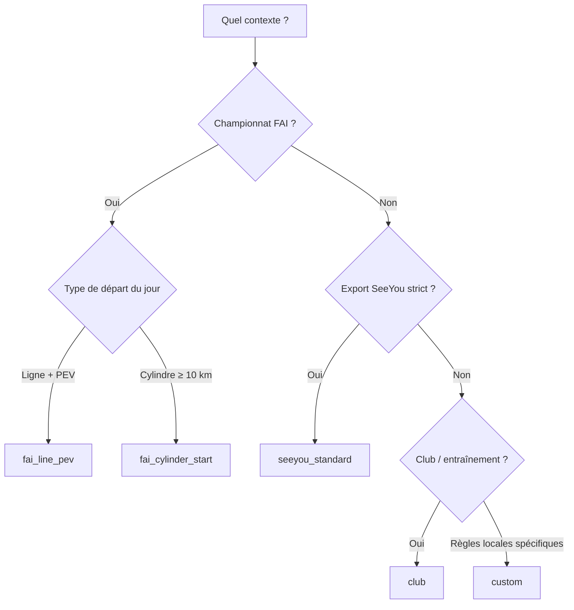

# Réglements de circuit et zones d’observation

Document de référence pour **Glide Task Planner** (vav-angular) : synthèse des règles officielles (FAI / IGC / SeeYou CUP) et de ce que l’application impose ou laisse configurer.

**Dernière mise à jour :** mai 2026 — sources principales : [FAI SC3 Annexe A 2024](https://www.fai.org/sites/default/files/sc3a_2024.pdf), [FAI SC3 Section 3 2024](https://www.fai.org/sites/default/files/sc3_2024.pdf), [SeeYou CUP v1.2.0](https://github.com/naviter/seeyou_file_formats/blob/main/CUP_file_format.md).

> **Audit implémentation :** pour corriger ou adapter l’app, voir **[sources-fiables-audit-implementation.md](./sources-fiables-audit-implementation.md)** (sources vérifiables, écarts code vs FAI/CUP/XCSoar, priorités de correctifs).

---

## 1. Contexte : trois niveaux de « réglement »

| Niveau | Qui fixe les règles | Rôle dans l’app |
|--------|---------------------|-----------------|
| **Sporting Code FAI / IGC** | Fédération (championnats mondiaux, continentaux, règles de départ/arrivée, OZ des virages en Racing Task, etc.) | Profils `fai_line_pev`, `fai_cylinder_start` |
| **Organisateur / CD** | Fiche de tâche du jour, procédures locales, rayons, PEV, NoStart, vitesses max | Profil `custom` + surcharges |
| **Club / entraînement** | Souplesse, export malgré avertissements | Profil `club` |
| **Écosystème SeeYou / XCSoar** | Format fichier `.cup` (géométrie des zones, tolérances NearDis/NearAlt) | Profil `seeyou_standard`, export CUP/TSK |

L’application ne remplace pas la **fiche de tâche** ni les **procédures locales** : elle aide à construire un circuit cohérent avec un profil choisi et à exporter des fichiers exploitables par SeeYou, XCSoar, etc.

---

## 2. Types de tâche (réglementation FAI — hors profils app)

Ces types définent *comment* le score est calculé ; les zones d’observation en découlent partiellement.

### 2.1 Racing Task (tâche de course — §6.3.1 Annexe A)

- **Structure :** départ → virages (ordre imposé) → arrivée.
- **Virages :** zone d’observation = **cylindre vertical** centré sur le point ; **rayon 500 m** pour une Racing Task standard (fixé par le code, pas par la fiche de tâche).
- **Départ / arrivée :** géométries de *Start* et *Finish* selon §7.4 et §7.8 (ligne ou anneau/cylindre — voir ci‑dessous).
- **Distance de tâche :** du point de départ au point d’arrivée via les virages, **moins** le rayon de l’anneau de départ et/ou d’arrivée si utilisés.

### 2.2 Assigned Area Task (§6.3.2, §7.6.2)

- **Zones :** cercle autour d’un point **ou** figure au sol (deux caps depuis le point, distance max, distance min optionnelle).
- **Séparation :** aires consécutives ≥ **1 km**.
- **Crédit :** fix dans la zone **ou** segment de trajectoire qui coupe la zone (§7.6.4).
- **Tolérance 500 m** hors zone : même logique que les virages (§7.6.5) — pénalité ou pas de crédit, au choix du scoreur pour maximiser le score.

*Non modélisé comme type de tâche distinct dans l’app aujourd’hui ; les secteurs CUP (Style 0/2 + A1, R2, A2) permettent une approximation visuelle/export.*

### 2.3 Distance Handicap Task — DHT (§6.3.3)

- Variante Racing avec **rayons d’OZ des virages variables** selon handicap planeur et angle de virage de la route.
- Rayons **publiés sur la fiche de tâche par planeur** ; algorithme approuvé IGC dans les procédures locales.

*L’app applique un seul rayon « virage » par profil ; pas de rayon par handicap.*

---

## 3. Départs (Start) — FAI Annexe A §7.4

Deux familles officielles ; chaque jour, le type et les options sont sur la **fiche de tâche**.

### 3.1 Ligne de départ (Line Start — §7.4.3)

| Élément | Imposé par FAI | Publié fiche de tâche | Configurable app |
|---------|----------------|----------------------|------------------|
| Géométrie | Franchissement d’une **ligne** de longueur définie, perpendiculaire au cap vers le 1er virage / centre 1ère aire | Longueur de ligne (= demi‑largeur × 2, modélisée par **R1** + **A1** + **Line=1** en CUP) | Oui (rayon départ, préréglage `start_line`) |
| Options | **Normal** ou **PEV** | Si PEV : *PEV Wait* et *PEV Window* ∈ **5–10 min** chacun | Profils FAI : 5 + 10 min ; custom : oui |
| PEV | Appui PEV **avant** la ligne ; fenêtre sans pénalité = Wait puis Window ; max **3 PEV** / lancement ; PEV < 30 s regroupés | Heures d’ouverture/fermeture du start | `pevEnabled`, `pevWaitMin`, `pevWindowMin` ; avertissement si `NoStart` CUP absent |
| Énergie | **Altitude max de départ** (MSA) + **vitesse sol max** (≥ 170 km/h « sans vent » recommandé) | Valeurs par classe | FAI profils : 180 km/h en méta ; MSA non exportée CUP |
| Validité tolérante | Fix à **≤ 500 m** de la ligne après ouverture → départ validé avec pénalité | — | Rappel scoring (texte compliance) |

**Correspondance CUP (départ) :** en général `Style=2` (vers point suivant), `Line=1`, `A1=180`, `R1` = demi‑longueur utile de la ligne (souvent 5 km en championnat → R1 5000 m).

### 3.2 Départ cylindre (Cylinder Start — §7.4.4)

| Élément | Imposé par FAI | Publié fiche de tâche | Configurable app |
|---------|----------------|----------------------|------------------|
| Géométrie | **Cylindre** centré sur le point de départ ; rayon **≥ 10 km** (recommandation forte) | Rayon exact | `start_cylinder_fai` : R1 ≥ 10 000 m ; contrainte `departure_must_be_cylinder` |
| Start | **PEV** dans le cylindre = heure/lieu/altitude de départ ; sans PEV = sortie du cylindre (pénalité) | Intervalle min entre PEV : **10 min** | PEV activable ; pas d’export de l’intervalle 10 min |
| Scoring | **Dernier** départ valide (contrairement à la ligne : meilleur départ) | Perte de hauteur max, vitesse sol max | Méta `startKind: cylinder` |
| Arrivée liée | Altitude d’arrivée sans pénalité liée à l’altitude de départ (§7.4.4.7) | *Maximum Loss of Height* | Non géré dans l’export |

**Correspondance CUP :** `Style=0`, pas de `Line=1`, `R1` ≥ 10 km.

### 3.3 Procédures communes départ (§7.4.2)

- Ouverture du start : en principe **30 min** après dernière offre de lancement (min. **20 min**).
- **NoStart** (heure d’ouverture) : option CUP `NoStart=HH:MM:SS` — recommandé si PEV.
- Pré‑altitude avant départ : procédure locale optionnelle (pas un paramètre CUP ObsZone).

---

## 4. Arrivée (Finish) — FAI §7.8

| Géométrie | Règle FAI | Modèle CUP dans l’app |
|-----------|-----------|------------------------|
| **Finish Line** | Ligne au sol, franchissement dans le sens indiqué ; altitude min possible | `finish_line` : Style 3, Line=1, A1=180, R1 = demi‑longueur |
| **Finish Ring** | Cercle rayon **≥ 3 km** autour du site ; entrée dans l’anneau = finish | `arrival_cylinder` ou cylindre R1 ≥ 3000 m — **pas de préréglage championnat dédié** |

Championnats : Finish Ring **préféré** (§7.8.2). Profils FAI de l’app utilisent aujourd’hui une **ligne d’arrivée** (5 km) pour coller aux exports SeeYou club/championnat courants.

---

## 5. Format CUP — paramètres de zone d’observation (SeeYou v1.2)

Chaque point de la séquence de tâche (index `ObsZone=n`) peut avoir :

| Paramètre | Signification | Imposé par la spec | Configurable dans l’app |
|-----------|---------------|--------------------|-------------------------|
| **Style** | 0 fixe, 1 symétrique, 2 vers suivant, 3 vers précédent, 4 vers départ | Toujours présent | Oui (sauf profils qui verrouillent le préréglage) |
| **R1** | Rayon principal (m) | Toujours | Oui ; min 50 m en UI ; FAI cylindre ≥ 10 km |
| **A1** | Angle 1 (°) — secteur ou ligne | Si secteur ou ligne | Oui si visible |
| **R2** | Rayon intérieur (m) — secteur annulaire / keyhole | Si secteur avec trou | Oui |
| **A2** | Angle 2 (°) — secteur intérieur FAI | Si keyhole FAI | Oui |
| **A12** | Cap de référence (Style 0 + secteur) | Optionnel | Oui si Style 0 + secteur |
| **Line** | `Line=1` → ligne de départ/arrivée (demi‑espace coupé) | Départ / arrivée | Oui sur départ/arrivée |

**Visibilité des champs** (logique `cupZoneParamVisibility`) :

- **Cylindre simple :** Style, R1.
- **Ligne :** + A1, Line.
- **Secteur :** + A1, R2 ; si R2 > 0 : + A2 ; si Style 0 : + A12.

Les valeurs inutilisées sont **retirées** à l’export (`applyCupZoneParamVisibility`).

### 5.1 Préréglages de zones implémentés

| ID préréglage | Géométrie | Style | R1 (défaut) | A1 | R2 / A2 / A12 | Line | Rôles typiques |
|---------------|-----------|-------|-------------|-----|---------------|------|----------------|
| `cylinder_fixed` | Cylindre | 0 | rayon virage | — | — | non | Virage |
| `cylinder_symmetric` | Cylindre | 1 | rayon virage | — | — | non | Virage |
| `start_line` | Ligne départ | 2 | rayon départ | 180 | — | oui | Départ |
| `finish_line` | Ligne arrivée | 3 | rayon arrivée | 180 | — | oui | Arrivée |
| `departure_cylinder` | Cylindre | 0 | rayon départ | — | — | non | Départ |
| `arrival_cylinder` | Cylindre | 0 | rayon arrivée | — | — | non | Arrivée |
| `start_cylinder_fai` | Cylindre FAI | 0 | max(r, 10 km) | — | — | non | Départ championnat |
| `sector_to_next` | Secteur | 2 | rayon | 90 | — | non | Virage / départ |
| `sector_fai` | Keyhole FAI | 0 | 30 km | 45 | R2 12 km, A2 12°, A12 123.4° | non | Virage compétition |
| `custom` | Libre | * | * | * | * | * | Tous |

---

## 6. Options de tâche CUP (ligne `Options,...`)

Indépendantes des `ObsZone`, mais liées au « réglement » exporté :

| Option | Rôle | SeeYou / usage | Profils app (valeurs par défaut) |
|--------|------|----------------|----------------------------------|
| **BeforePts** | Points obligatoires en tête de séquence (1 = ligne seule, 2 = ligne + 1er point) | Scoring SeeYou | Club/SeeYou : auto ; FAI : **2** |
| **AfterPts** | Idem en fin (1 = ligne arrivée, 2 = + point avant) | Scoring SeeYou | Club/SeeYou : auto ; FAI : **2** |
| **WpDis** | Distance tâche : waypoints (`True`) ou fixes GNSS (`False`) | Calcul distance | Tous : **False** |
| **NearDis** | Tolérance distance (m ou km) | Proximité waypoint | Club 70 m ; SeeYou 700 m ; FAI 500 m |
| **NearAlt** | Tolérance altitude (m) | Validité 3D | **300 m** (tous profils) |
| **NoStart** | Heure d’ouverture ligne de départ (UTC) | Start gate | Custom : oui ; FAI : recommandé si PEV |
| **TaskTime** | Durée désignée (HH:MM:SS) | AAT / contraintes temps | Custom uniquement |
| **MinDis**, **RandomOrder**, **MaxPts**, **Bonus** | Autres modes SeeYou | Selon organisateur | Non exposés dans l’UI |

---

## 7. Profils de réglement dans Glide Task Planner

Cinq profils (`TaskRuleProfileId`) : comportement **imposé** vs **surchargeable** (profil `custom` ou champs avancés FAI).

### 7.1 Club (libre)

| Catégorie | Imposé | Configurable (surcharges) |
|-----------|--------|---------------------------|
| Rayons D / V / A | 400 / 400 / 400 m (défaut) | Oui (`radiiM`) |
| Zones par rôle | Ligne départ, cylindre virage, ligne arrivée | Par point (dialogue zone) ; préréglages non verrouillés |
| Aérodromes D/A | Recommandés (avertissements seulement) | — |
| PEV / vitesse max | Désactivés | — |
| Options CUP | NearDis 70 m, NearAlt 300 m, Before/After auto | Partiellement via custom |
| Export | **Autorisé malgré erreurs** (confirmation) | — |

**Zones autorisées par rôle :** tous les préréglages compatibles avec le rôle.

---

### 7.2 SeeYou standard

| Catégorie | Imposé | Configurable |
|-----------|--------|--------------|
| Rayons | 500 / 500 / 500 m | Non (sans passer custom) |
| Contraintes | Départ et arrivée **doivent être des lignes** (`departure_must_be_line`, `arrival_must_be_line`) | Non |
| Options CUP | NearDis **700 m**, WpDis False, NearAlt 300 m | Non |
| Export | Bloqué si erreurs | — |

**Zones autorisées :**

- Départ : `start_line`, `sector_to_next`, `custom`
- Arrivée : `finish_line`, `arrival_cylinder`, `custom`
- Virage : cylindres / secteurs selon préréglage + `custom`

---

### 7.3 FAI — Ligne + PEV (`fai_line_pev`)

Aligné sur **Annexe A §7.4.3** (Line Start + PEV Start).

| Catégorie | Imposé | Configurable |
|-----------|--------|--------------|
| Rayons | Départ/arrivée **5000 m**, virages **500 m** | PEV wait/window, NoStart (mode avancé) |
| Départ | **Ligne** obligatoire | Non (sauf `custom`) |
| Arrivée | **Ligne** obligatoire | Non |
| Aérodromes | **Obligatoires** en D et A | — |
| Virages | ≥ 1 virage | — |
| PEV | Activé ; wait/window **5–10 min** (validés) | `pevWaitMin`, `pevWindowMin` |
| Vitesse sol max départ | **180 km/h** (rappel compliance) | Non dans export |
| Options CUP | BeforePts/AfterPts **2**, NearDis **500 m** | `noStart` |
| Export | Bloqué si erreurs | — |

**Zones autorisées :** même logique que SeeYou pour D/A (lignes) ; virage : cylindre fixe 500 m par défaut.

---

### 7.4 FAI — Cylindre départ (`fai_cylinder_start`)

Aligné sur **§7.4.4** (Cylinder Start).

| Catégorie | Imposé | Configurable |
|-----------|--------|--------------|
| Rayons | Départ **≥ 10 000 m**, virages 500 m, arrivée 5000 m | PEV, NoStart (avancé) |
| Départ | **Cylindre** sans `Line=1` ; R1 ≥ `cylinderMinRadiusM` (10 km) | Non |
| Arrivée | Ligne (profil actuel) | — |
| PEV | Comme ligne FAI | wait/window |
| Contraintes | Aérodromes, min virages, PEV 5–10 min | — |

**Zones autorisées départ :** `departure_cylinder`, `start_cylinder_fai`, `custom` (pas de ligne).

---

### 7.5 Personnalisé (`custom`)

| Catégorie | Imposé | Configurable |
|-----------|--------|--------------|
| Tout | Valeurs de base type club | **Rayons**, **PEV**, **type départ** (ligne/cylindre), **options CUP**, **liste de contraintes** |
| Validation | Selon contraintes cochées | `constraints[]` |
| Export | Bloqué si erreurs | — |

**Zones :** tous les préréglages pour chaque rôle.

#### Contraintes optionnelles (custom)

| ID | Effet |
|----|--------|
| `require_airfield_departure` | 1er point = aérodrome |
| `require_airfield_arrival` | Dernier point = aérodrome |
| `departure_must_be_line` | Zone départ avec `Line=1` |
| `arrival_must_be_line` | Zone arrivée avec `Line=1` |
| `departure_must_be_cylinder` | Pas de ligne ; R1 ≥ min cylindre FAI |
| `min_turnpoints` | Au moins 1 virage |
| `pev_wait_window_range` | Si PEV : 5–10 min pour wait et window |

---

## 8. Matrice : réglement → zones d’observation par rôle

Légende : **I** = imposé par le profil (ou FAI via profil), **C** = configurable par point, **—** = non applicable.

| Zone / rôle | Club | SeeYou | FAI ligne+PEV | FAI cyl. départ | Custom |
|-------------|------|--------|---------------|-----------------|--------|
| Départ — ligne (`start_line`) | C (défaut) | I | I | — | C |
| Départ — cylindre (`start_cylinder_fai`) | C | — | — | I | C |
| Départ — secteur vers suivant | C | C | C | — | C |
| Virage — cylindre 500 m | C (défaut) | I* | I* | I* | C |
| Virage — secteur / keyhole FAI | C | C | C | C | C |
| Arrivée — ligne (`finish_line`) | C (défaut) | I | I | I | C |
| Arrivée — cylindre (anneau ≥ 3 km) | C | C | —** | —** | C |

\* Rayon virage imposé par le profil (500 m FAI), géométrie cylindre fixe par défaut.  
\*\* Profil FAI actuel : ligne 5 km ; anneau d’arrivée reste possible en `custom` / édition manuelle.

### Paramètres CUP par type de zone (résumé)

| Type | Style (I/C) | R1 | A1 | R2, A2, A12 | Line |
|------|-------------|-----|-----|-------------|------|
| Cylindre fixe/sym. | C (preset fixe Style 0/1) | C (rayon règlement) | — | — | — |
| Ligne D/A | I (2 ou 3) | C (souvent imposé par rayon D/A) | I (180°) | — | I (1) |
| Secteur simple | C | C | C (ex. 90°) | — | — |
| Secteur FAI keyhole | I (0) | I (30 km typ.) | I | I (R2, A2, A12) | — |

---

## 9. Écarts entre réglementation officielle et l’application

À connaître pour ne pas sur‑interpréter la validation de l’app :

| Sujet | FAI / IGC | App |
|-------|-----------|-----|
| Finish Ring ≥ 3 km | Option championnat préférée | Pas de profil dédié ; possible en `arrival_cylinder` + R1 ≥ 3000 |
| MSA / altitude max départ | Obligatoire championnat | Non exporté |
| Intervalle 10 min entre PEV (cylindre) | Oui | Non modélisé |
| DHT rayons par handicap | Par planeur | Un seul `turnpointM` |
| Assigned Areas (figures complexes) | §7.6.2 | Approximation via secteurs CUP |
| Scoring IGC réel | SeeYou + fichiers IGC | Export CUP/TSK ; note « scoring = SeeYou » dans l’UI |

---

## 10. Références

1. **FAI Sporting Code — Section 3 Gliding (2024)** — tâches Racing / AAT : [sc3_2024.pdf](https://www.fai.org/sites/default/files/sc3_2024.pdf)  
2. **Annexe A — Championnats mondiaux et continentaux (2024)** — départs §7.4, virages §7.6, arrivée §7.8 : [sc3a_2024.pdf](https://www.fai.org/sites/default/files/sc3a_2024.pdf)  
3. **SeeYou CUP file format v1.2.0** — `ObsZone`, `Options` : [CUP_file_format.md](https://github.com/naviter/seeyou_file_formats/blob/main/CUP_file_format.md)  
4. **Code source Glide Task Planner** — `src/app/models/task-rule-profile.model.ts`, `observation-zone.model.ts`, `task-rule-engine.service.ts`

---

## 11. Schéma de décision (choix du profil)

Pour chaque point du circuit, ouvrir le **dialogue zone** : les champs affichés suivent la géométrie (cylindre / ligne / secteur) et le profil peut **restreindre la liste des préréglages** (`allowedPresetsForRole`).
